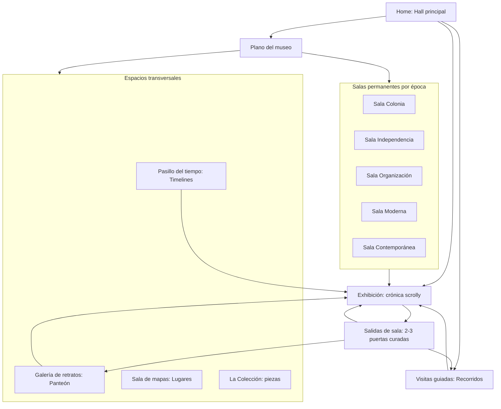
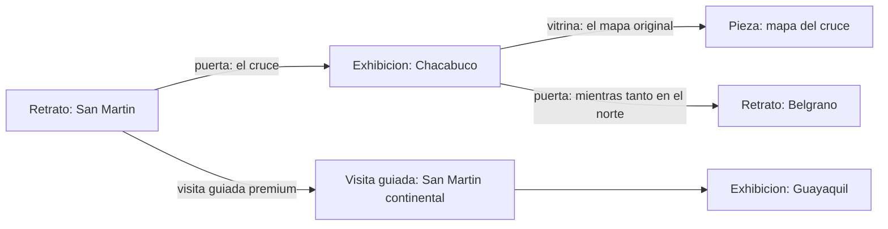

# Estrategia: de sitio de historia a museo digital

**Argent / MuseoArgent — Documento estratégico de producto**
Julio 2026 · Versión 1.0 (para aprobación antes de implementar)

La pregunta de diseño que gobierna todo este documento no es "¿cómo mostramos mejor este artículo?" sino **"¿cómo hacemos que el visitante quiera recorrer la siguiente sala?"**. El competidor mental no es otro sitio de historia: es una visita presencial a un museo.

---

## 1. Diagnóstico del producto actual

### 1.1 Lo que ya existe (y es más museo de lo que parece)

El inventario real del producto es el de un museo, no el de un blog:

| Activo | Volumen | Estado |
|---|---|---|
| Crónicas scrollytelling (MDX + GSAP) | 99 (56 públicas, 43 mecenas) | Producto estrella, calidad alta |
| Personajes (Panteón) | ~24 fichas con aliados/enemigos/línea de vida | Sólido |
| Efemérides narrativas (`/hoy`) | ~67 días | Sólido |
| Recorridos curados | 9 (3 premium) | Contenido bueno, presentación débil |
| Lugares con mapa | Ficha + mapa (preview gratis / completo mecenas) | Sólido |
| Timelines | 1516–hoy, explorador por año | Híbrido |
| Grafo de entidades (`src/lib/grafo/`) | Conecta persona/evento/lugar/período/crónica/categoría, con estrategias de descubrimiento (`relacionados`, `sorpresa`, `misma-epoca`, `mismo-anio`…) | **Infrautilizado en la UI** |
| Imágenes históricas (`cronicas-imagenes.ts`) | ~100+ piezas Wikimedia con tipo (grabado, pintura, mapa, foto) | Usadas solo como decoración de heros |

La identidad visual ya es de museo: paleta "museo nocturno, papel viejo y oro antiguo" (`#0c0a08` / `#c6a15b`), Fraunces + Inter, grano de película, texturas de pergamino, capitulares. El copy (voseo, "Tu museo", "Seguí donde lo dejaste") también.

La monetización (Mecenas vía MercadoPago, magic link, soft-gate) está construida y lista para lanzamiento controlado.

### 1.2 El problema real

**Argent es un museo con vestíbulo de revista.** La inmersión existe, pero solo *adentro* de cada crónica. Todo lo que rodea a las crónicas —catálogo, hubs, recorridos, timeline, explorar— usa patrones de blog/catálogo: grids de cards uniformes, filtros por query-string, listas con `border-bottom`, wizards paginados, navegación dura entre rutas sin continuidad visual.

El visitante entra a una sala espectacular, pero entre sala y sala camina por un pasillo de oficina.

---

## 2. Qué transmite hoy

- **Dentro de una crónica:** documental interactivo de primer nivel. Hero cinematográfico, mapas sticky con scroll, comparadores, citas a pantalla completa. Sensación: NYT interactive / Google Arts & Culture.
- **En la home:** portada editorial fuerte con hero nocturno y curaduría ("Rostros del museo", efeméride del día). La mejor página no-crónica del sitio.
- **En `/cronicas`:** catálogo tipo Netflix/magazine. Cards 16:10 con kicker + título + `line-clamp-2` + metadatos de "duración de lectura". Es la pantalla que más grita "blog".
- **En `/explorar`:** un directorio. Pills de épocas, categorías y años. UX de sitemap curado, no de hall de museo.
- **En `/recorridos/[slug]`:** un wizard de curso online. Barra de porcentaje, botones anterior/siguiente. El contenido es de recorrido guiado; el envase es de formulario multipaso.
- **En `/timelines/[anio]`:** mitad y mitad. El año en tipografía gigante es museo; la lista de eventos debajo es índice de Wikipedia.
- **Entre páginas:** nada. Sin transiciones, sin continuidad hero→detalle, cada navegación es un corte seco.

## 3. Qué debería transmitir

Cada superficie debería responder a una metáfora museográfica concreta:

| Superficie | Metáfora | Emoción objetivo |
|---|---|---|
| Home | Hall principal: umbral, mapa de salas, "qué hay hoy" | Impacto, invitación |
| Catálogo | Plano del museo / salas por época | Orientación, deseo de entrar |
| Crónica | Exhibición inmersiva (ya lo es) | Inmersión, asombro |
| Final de crónica | Salidas de sala: "por acá se sigue a…" | Curiosidad, continuidad |
| Recorrido | Visita guiada continua, un pasillo con hilo narrativo | Acompañamiento |
| Panteón | Galería de retratos | Prestigio, patrimonio |
| Timeline | Pasillo cronológico que se camina | Escala temporal |
| Lugares | Sala de mapas | Territorio |
| Piezas (imágenes, documentos, citas) | Vitrinas con ficha técnica | Autenticidad |
| Mecenas | Sala privada del patrono | Pertenencia |

El principio operativo: **el visitante nunca debería llegar a un callejón sin salida ni a una lista neutra.** Toda pantalla termina en 2–3 puertas curadas hacia la siguiente sala.

---

## 4. Elementos que rompen la experiencia de "museo"

Ordenados por gravedad:

1. **`CronicaCardCompacta` + `GridCronicas`** — el patrón visual de card de blog (thumb 16:10, título, resumen recortado, metadatos) es el elemento más anti-museo del producto, y se repite en catálogo, hubs de época/categoría, timelines y recorridos.
2. **Recorridos como wizard** (`RecorridoPasos`): paginación con porcentaje en lugar de un recorrido que se *camina* con scroll.
3. **`/explorar` como directorio de pills** — es la puerta de descubrimiento y es la página menos evocadora del sitio.
4. **Ausencia total de transiciones entre rutas** — cada click es un corte que recuerda que esto es un sitio web, no un espacio.
5. **Listas de eventos en `/timelines/[anio]`** — filas con borde inferior, patrón de changelog.
6. **Heterogeneidad de las `EscenasXxx`** — las crónicas antiguas tienen mapas SVG artesanales; muchas nuevas son solo wrappers de `PanelImagenComparador`. La promesa de "experiencia inmersiva" se cumple de forma despareja.
7. **Vocabulario residual de blog** en superficies secundarias: "categorías", "filtros", "duración de lectura", "artículos relacionados" (el copy central ya es museográfico, pero la periferia no).
8. **El grafo casi no se ve**: existe un motor de conexiones sofisticado, pero en la UI aparece como bloques genéricos de "Enlaces relacionados" al pie. La riqueza relacional (San Martín → Chacabuco → Chile → O'Higgins → Guayaquil) está en los datos y no en la experiencia.
9. **Las imágenes históricas no son piezas**: ~100 grabados, pinturas y mapas de Wikimedia se usan como fondos decorativos, sin ficha, sin autor, sin poder verse en detalle.

## 5. Oportunidades de mejora

Las cinco palancas de mayor retorno, todas apoyadas en activos que **ya existen**:

1. **Hacer visible el grafo.** El sistema de descubrimiento pedido en la consigna ya está programado (`descubrir()`, `relacionados()`, 6 estrategias). Falta la capa de presentación: convertirlo en "puertas de sala" curadas y contextuales en lugar de listas al pie.
2. **Museografiar la capa de catálogo.** Reemplazar el patrón card-grid por fichas de sala y planos del museo. Es puro trabajo de diseño de componentes; los índices (`lib/cronicas/indice.ts`) no cambian.
3. **Continuidad espacial.** View Transitions (Next.js 16 lo soporta) para que la imagen/título de una ficha se transforme en el hero de la exhibición. Es el cambio con mejor relación costo/impacto para la sensación de "espacio".
4. **Elevar las piezas a ciudadanos de primera.** `cronicas-imagenes.ts` ya tiene tipo, crédito y fuente por imagen. Con una ruta `/piezas/[id]` y un visor con ficha técnica, el museo gana su colección — y una superficie SEO enorme (100+ páginas indexables de patrimonio visual).
5. **Recorridos como producto insignia de la monetización.** Ya hay 3 recorridos premium; si el recorrido pasa de wizard a visita guiada continua (y a futuro con audioguía), se convierte en el argumento de venta más tangible de Mecenas.

---

## 6. Nuevo modelo de navegación

### 6.1 Modelo mental: el museo tiene salas, no secciones

### 6.2 Decisiones de navegación

- **Las URLs no cambian.** `/cronicas`, `/periodos`, `/categorias`, etc. tienen SEO trabajado (sitemap, JSON-LD, OG por página). El cambio de lenguaje es de **presentación**: `/periodos/[slug]` se presenta como "Sala", `/categorias` como "Colecciones temáticas", el catálogo como "Plano del museo". Si más adelante conviene renombrar rutas, se hace con redirects 301, pero no es requisito de la fase inicial.
- **Header re-jerarquizado** alrededor de tres verbos: *Recorrer* (recorridos), *Explorar* (plano/salas), *Hoy* (efeméride). El Panteón y el Mapa quedan dentro de Explorar. Menos ítems, más intención.
- **Regla de las tres puertas:** toda página de detalle (crónica, personaje, lugar, año, efeméride) termina con exactamente 2–3 salidas curadas por el grafo, cada una con un *puente narrativo* (el campo `puente` ya existe en `recorridos.ts`; se generaliza). Nunca una lista de 8 links genéricos.
- **Persistencia de la visita:** el sistema existente de `localStorage` (`RegistrarVisita`, `PortadaRetorno`) evoluciona a "tu visita": qué salas viste, qué recorrido tenés a medias, sugerencia de próxima sala. Sin cuentas, sin fricción.

## 7. Nueva arquitectura de información

La arquitectura de datos actual es correcta y se conserva. Los cambios son de vocabulario, jerarquía y una entidad nueva:

| Concepto actual (código) | Concepto museográfico (presentación) | Cambio |
|---|---|---|
| Crónica | **Exhibición** | Solo copy/UI |
| Época (`periodos`) | **Sala permanente** | Solo copy/UI |
| Categoría | **Colección temática** | Solo copy/UI |
| Recorrido | **Visita guiada** | Copy + rediseño de experiencia |
| Panteón | Galería de retratos (ya está bien) | Ninguno |
| Efeméride `/hoy` | **La pieza del día** | Reencuadre en home |
| `cronicas-imagenes.ts` | **Pieza de la colección** | **Entidad nueva de primera clase** |
| Nodo del grafo | Puerta / conexión | Solo UI |

**La entidad nueva: Pieza.** Cada imagen histórica (grabado, pintura, mapa, documento, foto) gana:

- Ficha técnica: título, autor, año, tipo, técnica, fuente (Wikimedia), qué exhibiciones la muestran.
- Visor de detalle con zoom (imagen grande, fondo negro, la pieza como protagonista).
- Nodo en el grafo (`tipo: "pieza"`), conectada a crónicas, personajes y lugares.
- Ruta indexable `/piezas/[id]` + colección navegable `/piezas`.

Esto convierte activos que ya están catalogados en el archivo `cronicas-imagenes.ts` en el corazón patrimonial del museo, con costo editorial bajo (los metadatos base ya existen).

## 8. Sistema de descubrimiento

### 8.1 El motor ya existe; falta la museografía

`src/lib/grafo/queries.ts` ya resuelve el caso de uso pedido: desde San Martín se puede llegar a Chacabuco, Belgrano, la Independencia, Chile, Guayaquil. El trabajo es de **capa de experiencia**, en tres niveles:

**Nivel 1 — Salidas de sala (fin de cada exhibición).** Al terminar una crónica, en lugar de `EnlacesRelacionados` genérico: una pantalla de cierre a pantalla completa con 2–3 puertas grandes, cada una con imagen, tipo de destino ("Otra exhibición", "Un retrato", "Una visita guiada") y un puente narrativo de una línea ("Mientras San Martín cruzaba los Andes, Belgrano sostenía el norte"). Curación editorial cuando exista (campo opcional en taxonomía), fallback automático del grafo cuando no.

**Nivel 2 — Vitrinas contextuales (durante la lectura).** Componente MDX `VitrinaContexto`: al mencionar a Belgrano dentro de la crónica de San Martín, un aside discreto con retrato y micro-bio que invita a la ficha del Panteón. Igual para lugares y piezas. Ya hay ~130 componentes MDX; este se suma al vocabulario editorial.

**Nivel 3 — El hilo del visitante.** El historial local se convierte en narrativa: "Venís de la Sala Independencia. Te faltan 2 exhibiciones para completarla." Completar una sala o un recorrido produce un momento de cierre (sin gamificación infantil: sellos sobrios, estética de catálogo de museo).

### 8.2 Ejemplo del flujo objetivo

Cada flecha lleva texto puente. La exploración se siente infinita porque cada nodo ofrece salidas nuevas, pero curadas — nunca un mar de links.

---

## 9. Propuesta de experiencia

### 9.1 Home: el hall principal

La home actual ya es buena; se refina, no se refunda:

- **Umbral:** el hero nocturno se mantiene como marca. Se le suma profundidad (parallax sutil ya existente) y un CTA único dominante: "Comenzar la visita" (ruta inteligente que ya existe en `RutaRecomendada`).
- **El plano a la vista:** debajo del hero, las 5 salas por época como puertas visuales grandes (no cards): nombre de sala, rango de años, imagen/silueta característica, cuántas exhibiciones contiene y cuántas viste.
- **La pieza del día:** la efeméride se presenta como objeto de vitrina (imagen + año gigante), reforzando el ritual de visita diaria.
- **Rostros del museo** se conserva tal cual: ya es galería.
- Se elimina cualquier resto de "listado": la home nunca muestra más de una exhibición concreta a la vez.

### 9.2 Plano del museo (evolución de `/cronicas` + `/explorar`)

- `/explorar` se convierte en **el plano**: una vista espacial de las salas (composición visual de las 5 épocas + espacios transversales), no pills. Cada sala muestra su estado para el visitante.
- `/cronicas` conserva la función de catálogo completo (necesaria para SEO y para quien quiere buscar algo puntual) pero con fichas rediseñadas: la `CronicaCardCompacta` se reemplaza por una **ficha de exhibición** — composición vertical tipo cartel de sala (imagen dominante, número de exhibición, título Fraunces, sin resumen recortado, sin "duración de lectura" visible; la duración pasa a un lenguaje de visita: "visita breve / visita completa").
- Los filtros no desaparecen (son útiles y accesibles) pero se re-presentan como "elegir sala / colección", visualmente integrados, no como toolbar de e-commerce.

### 9.3 Exhibiciones (crónicas)

- **Entrada con continuidad:** View Transition desde la ficha (la imagen y el título de la ficha se expanden al hero). Es el momento "cruzar la puerta de la sala".
- **Nivelación de calidad:** definir 3 tiers de exhibición (A: mapa scrolly + escenas custom; B: comparadores + piezas; C: prosa + piezas) y auditar las 99 crónicas para que ninguna prometa más de lo que da. Las `EscenasXxx` que son wrappers triviales se consolidan en un sistema paramétrico único (menos archivos, misma calidad, más fácil elevar todas a la vez).
- **Vitrinas:** las imágenes dentro de la crónica pasan a ser piezas clickeables (visor con ficha técnica).
- **Cierre de sala:** la pantalla de salidas curadas (sección 8.1) reemplaza al pie actual de links.

### 9.4 Visitas guiadas (recorridos)

Rediseño completo de `/recorridos/[slug]`: de wizard paginado a **página única continua** donde el recorrido se camina con scroll — una espina temporal/espacial fija (línea con los pasos) y cada paso como estación con su puente narrativo. El progreso es la posición en el scroll, no un porcentaje. En mobile, la espina vive abajo como mini-mapa del recorrido. Los 3 recorridos premium se convierten en la vitrina de venta de Mecenas.

### 9.5 Pasillo del tiempo (timelines)

`/timelines/[anio]` reemplaza las listas por un **friso**: los eventos del año como tarjetas de vitrina sobre una línea horizontal/vertical, con los personajes vivos como retratos al margen. El `TimelineExplorer` ya es bueno; se le da más protagonismo como puerta de entrada.

### 9.6 Movimiento (con criterio)

Solo tres familias de animación, cada una con significado espacial:

1. **Cruzar una puerta:** View Transitions ficha→hero, hall→sala.
2. **Caminar una sala:** el scrollytelling existente (GSAP), sin cambios de fondo.
3. **Detenerse ante una vitrina:** micro-elevación al enfocar piezas y puertas.

Todo respeta `prefers-reduced-motion` (ya implementado). Nada de animación decorativa suelta.

### 9.7 Mobile: el museo de bolsillo

- **Navegación inferior persistente** (thumb-first): Plano · Visita (continuar) · Hoy. El hamburger queda para lo secundario.
- Las puertas de sala y salidas de sala se diseñan primero para gesto vertical de una mano; el plano del museo en mobile es un carrusel vertical de salas, no un grid encogido.
- Los mapas scrolly ganan un modo compacto en pantallas chicas (resumen de etapas tocable) para bajar la exigencia de scroll.

### 9.8 Performance, SEO y accesibilidad (restricciones duras)

- Nada de lo anterior requiere JS pesado nuevo: View Transitions es API nativa, el grafo ya se resuelve en build/SSG, las piezas son páginas estáticas.
- Se mantienen: SSG masivo con `generateStaticParams`, ISR en home, `noindex` en exclusivas, JSON-LD (las piezas suman schema `VisualArtwork`/`CreativeWork` — mejora SEO neta).
- Presupuesto: LCP de heros vigilado (imágenes Wikimedia con `next/image` y prioridad correcta), CLS cero en transiciones, INP protegido evitando hidratar el plano completo (islas).
- Toda puerta/vitrina es un link real (`<a>`), navegable por teclado e indexable.

### 9.9 Monetización: el patrono del museo

La nueva experiencia le da a Mecenas argumentos tangibles en lenguaje de museo:

- **Hoy mismo (reframing):** "43 exhibiciones exclusivas, 3 visitas guiadas premium, el mapa completo y el pasillo del tiempo avanzado" — mismo inventario, mejor relato. El soft-gate se rediseña como "puerta de sala privada" (se ve el umbral, se invita a entrar).
- **Corto plazo:** colecciones de piezas exclusivas (documentos comentados), voto fundador ya existente presentado como "el patrono elige la próxima exhibición".
- **Mediano plazo:** **audioguías** por exhibición y por recorrido (el activo premium más "museo" posible; técnicamente simple: audio + sincronización ligera con secciones), sellos de visita coleccionables para mecenas.
- **Futuro:** exposiciones temporales (contenido con ventana de tiempo, primero para mecenas — el flag `anticipo` ya existe en el modelo y está sin uso).

---

## 10. Roadmap priorizado por impacto

Criterio: primero lo que cambia la *sensación* con menor esfuerzo, después lo estructural, después lo nuevo. Cada fase deja el sitio completo y coherente (no hay estados intermedios rotos).

### Fase 1 — El museo se siente (impacto alto, esfuerzo bajo-medio)

1. **View Transitions** ficha→exhibición y hall→sala (Next.js 16).
2. **Ficha de exhibición** nueva que reemplaza a `CronicaCardCompacta` en todo el sitio.
3. **Salidas de sala:** pantalla de cierre curada al final de cada crónica (grafo + puentes editoriales opcionales), reemplazando los bloques de links relacionados.
4. **Barrido de vocabulario:** salas, colecciones, exhibiciones, visitas guiadas, piezas — en `copy.ts`, headers, hubs y CTAs. Sin tocar URLs.
5. Home: puertas de sala bajo el hero + "pieza del día".

### Fase 2 — Se camina distinto (impacto alto, esfuerzo medio)

6. **Visitas guiadas continuas:** rediseño de `/recorridos/[slug]` de wizard a scroll con espina narrativa.
7. **El plano del museo:** rediseño de `/explorar` como vista espacial de salas; re-presentación de filtros en `/cronicas`.
8. **Tu visita:** evolución del historial local (progreso por sala, continuar recorrido, próxima sala sugerida).
9. **Navegación inferior mobile** + modo compacto de mapas scrolly.

### Fase 3 — La colección (impacto medio-alto, esfuerzo medio)

10. **Piezas como entidad:** modelo, ruta `/piezas/[id]` con visor y ficha técnica, integración al grafo, schema.org. Base: `cronicas-imagenes.ts`.
11. **Vitrinas contextuales** (`VitrinaContexto`) dentro de las crónicas.
12. **Friso temporal:** rediseño de `/timelines/[anio]`.
13. **Auditoría de tiers** de las 99 exhibiciones + consolidación paramétrica de `EscenasXxx`.

### Fase 4 — El museo vivo (impacto compuesto, esfuerzo alto)

14. **Audioguías** (primero en recorridos premium → argumento de venta Mecenas).
15. **Exposiciones temporales** (activar el flag `anticipo`).
16. Colecciones de piezas premium y sellos de visita para mecenas.

### Qué NO se hace

- No se cambian URLs ni se rompe el SEO existente.
- No se agrega CMS, Three.js, canvas 3D ni "tours virtuales" literales: la fuerza del producto es editorial, no de simulación.
- No se gamifica con puntos/badges infantiles; los sellos son sobrios y opcionales.
- No se toca el sistema de membresía/pagos (funciona); solo su presentación.

---

## Apéndice: decisiones abiertas para el dueño del producto

1. **Renombrar rutas** (`/periodos` → `/salas`, etc.): recomendado NO por ahora; revisar después de Fase 2 con datos de tráfico.
2. **Curaduría de puentes narrativos:** las salidas de sala funcionan con fallback automático del grafo, pero brillan con puentes escritos a mano. Definir si se escriben para las ~20 crónicas más visitadas primero.
3. **Audioguías:** ¿voz humana grabada o TTS de calidad? Impacta costos y ritmo de producción de la Fase 4.
